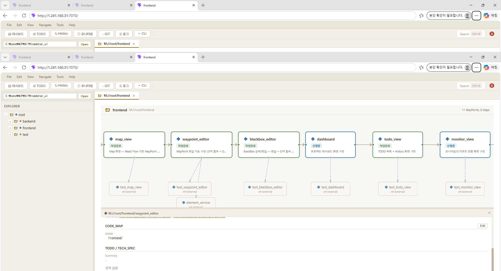

# LOADSTAR Explorer UI

LOADSTAR 방법론 기반 프로젝트 구조를 시각적으로 탐색하고 관리하는 웹 애플리케이션입니다.



## Overview

LOADSTAR Explorer는 `.loadstar/` 메타데이터(Map, WayPoint)를 Eclipse 스타일의 웹 UI로 제공합니다.
프로젝트의 구조를 흐름도로 시각화하고, WayPoint 편집, TODO 관리, Git 이력 조회, CLI 실행까지 하나의 화면에서 수행할 수 있습니다.

## Tech Stack

| Layer | Stack |
|:---|:---|
| Backend | Spring Boot 3.4, Java 17, Maven |
| Frontend | React 19, TypeScript, Vite |
| Visualization | React Flow (@xyflow/react) |
| Layout | react-resizable-panels |
| CLI | [loadstar_cli](https://github.com/aeolusk/loadstar_cli) (Go) |
| Spec | [loadstar_SPEC](https://github.com/aeolusk/loadstar_SPEC) |

## Features

### Map View
- React Flow 기반 흐름도로 Map/WayPoint 구조 시각화
- WayPoint 추가(앞/뒤/child), 삭제, 선택 하이라이트
- child/reference 배지 표시 및 펼침

### WayPoint Editor
- IDENTITY, CONNECTIONS, CODE_MAP, TECH_SPEC 섹션 편집
- TECH_SPEC 체크박스 토글, 항목 추가/삭제
- 변경 시 자동 로그 기록 (loadstar log)

### TODO
- WayPoint STATUS 기반 TODO 목록 (ACTIVE/PENDING/BLOCKED)
- Sync 버튼으로 CLI todo sync 실행
- History 탭에서 TECH_SPEC 완료 이력 조회 (Map 필터)

### Git History
- `.loadstar/` 커밋 이력 조회
- 커밋 선택 시 변경 파일 목록 표시 (Added/Modified/Deleted)

### Log Viewer
- loadstar log 검색 (KIND/Address 필터, 시간순 정렬)

### CLI Console
- loadstar CLI 명령을 웹에서 직접 실행
- 명령 이력 탐색, 색상 구분 출력

### Search
- Command Palette (Ctrl+K) 기반 통합 검색

## Prerequisites

- Java 17+
- Node.js 18+
- [loadstar_cli](https://github.com/aeolusk/loadstar_cli) 빌드된 바이너리

## Getting Started

```bash
# 1. 프론트엔드 빌드
cd frontend
npm install
npx vite build

# 2. 백엔드 실행 (프론트엔드 dist/ 서빙 포함)
cd ../backend
mvn spring-boot:run

# 3. 브라우저에서 접속
# http://localhost:8080
```

## Project Structure

```
loadstar_ui/
├── backend/              Spring Boot REST API
│   └── src/main/java/com/loadstar/explorer/
│       ├── controller/   REST 엔드포인트
│       └── service/      비즈니스 로직 (Element, Todo, Git, Log, CLI)
├── frontend/             React SPA (Vite)
│   └── src/
│       ├── features/     기능별 컴포넌트 (map-view, waypoint-editor, ...)
│       ├── components/   공통 컴포넌트 (AppShell, ElementTree, ...)
│       └── api/          API 클라이언트
├── .loadstar/            LOADSTAR 메타데이터
│   ├── MAP/              Map 요소
│   ├── WAYPOINT/         WayPoint 요소
│   └── .clionly/         CLI 전용 (TODO, LOG)
└── docs/                 문서 및 스크린샷
```

## Related Projects

- [loadstar_SPEC](https://github.com/aeolusk/loadstar_SPEC) - LOADSTAR 방법론 명세
- [loadstar_cli](https://github.com/aeolusk/loadstar_cli) - Go 기반 CLI 도구

## License

MIT
