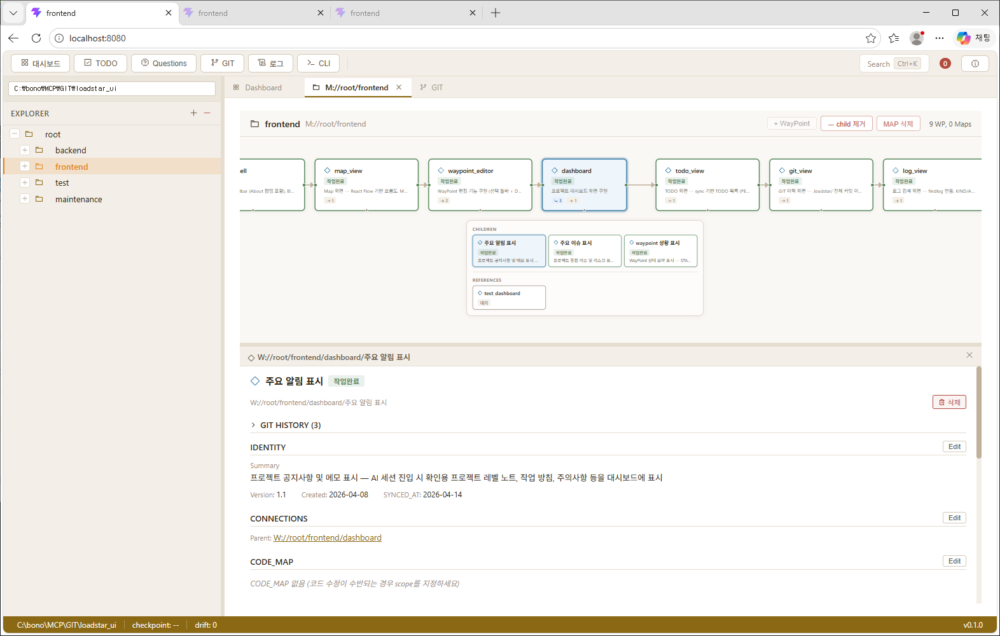
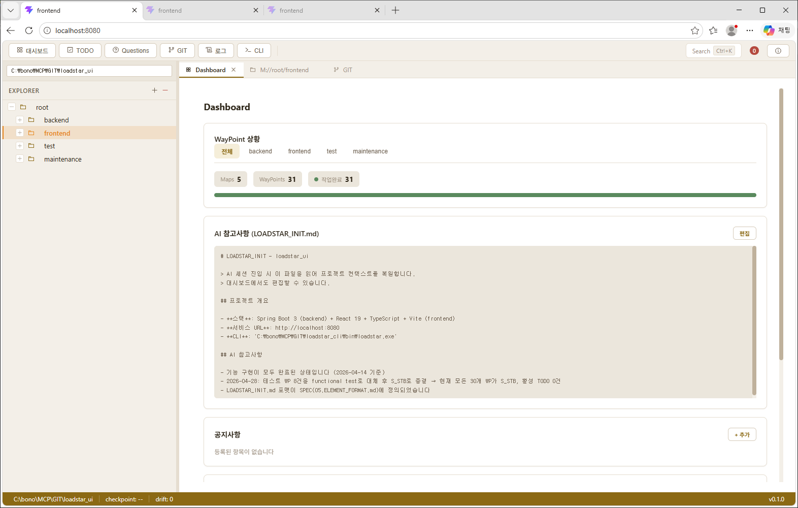
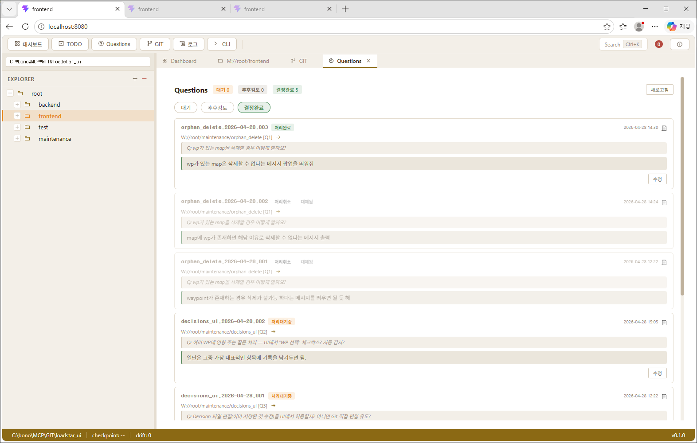

> 🌐 **English** | **[한국어](README.ko.md)**

# LOADSTAR Explorer UI

A web application for visually exploring and managing project structures based on the LOADSTAR methodology.



> 📌 New to LOADSTAR? Start with the [openLoadstar overview](https://github.com/openLoadstar/openLoadstar).

---

## 🧭 Overview

LOADSTAR Explorer provides an Eclipse-style web UI for `.loadstar/` metadata (Map · WayPoint · Decision · logs). Visualize project structure as a flowchart, and handle WayPoint editing, TODO management, Git history, and CLI execution — all from a single screen.

The CLI alone covers every feature, but for projects with **more than ~20 WayPoints** or **multiple collaborators**, the UI is effectively required.

---

## 🧱 Tech Stack

| Layer | Stack |
|:---|:---|
| Backend | Spring Boot 3.4, Java 17, Maven |
| Frontend | React 19, TypeScript, Vite |
| Visualization | React Flow (`@xyflow/react`) |
| Layout | `react-resizable-panels` |
| CLI integration | [openLoadstar/cli](https://github.com/openLoadstar/cli) (Go binary) |
| Spec | [openLoadstar/spec](https://github.com/openLoadstar/spec) |

---

## ✨ Key Features

### 📊 Dashboard



- WayPoint status at a glance — Map / WayPoints / completed item counts
- Per-Map progress bar visualization (All · backend · frontend · test · maintenance tabs)
- AI notes (`LOADSTAR_INIT.md`) display & edit — manage AI session entry context
- Announcement area — project-level memos

### 🗺️ Map View

- React Flow-based flowchart for visualizing Map / WayPoint structure
- Add WayPoints (before / after / as child), delete, selection highlight
- child / reference badge display and expand

### 📝 WayPoint Editor

- Edit IDENTITY · CONNECTIONS · CODE_MAP · TECH_SPEC sections
- Toggle TECH_SPEC checkboxes, add / delete items
- Automatically logs changes via `loadstar log`

### ✅ TODO

- TODO list based on WayPoint STATUS (ACTIVE / PENDING / BLOCKED)
- Sync button runs CLI `todo sync`
- History tab shows completed TECH_SPEC items (filterable by Map)

### ❓ Questions



- Aggregated OPEN_QUESTIONS view across WayPoints (Pending / Deferred / Resolved tabs)
- Write questions, record answers and decisions — decisions saved as ADRs in `.loadstar/DECISIONS/`
- Resolved questions categorized by outcome (Completed / Cancelled / Pending action)

### 🧾 Git History

- Browse `.loadstar/` commit history
- Selecting a commit shows the list of changed files (Added / Modified / Deleted)

### 📜 Log Viewer

- Search `loadstar log` output (KIND / Address filters, sorted chronologically)

### 💻 CLI Console

- Run loadstar CLI commands directly from the browser
- Command history navigation, color-coded output

### 🎯 Goals Report

- Tree view of Map → WayPoint hierarchy with SUMMARY / GOAL / TODO on one screen
- TODO / RECURRING sections toggle open/closed (default closed), showing completion ratio
- Print to PDF (new window — outputs only the Goals report, no app shell) and Markdown download

### 🔍 Search

- Unified search via Command Palette (`Ctrl+K`)

---

## 🛠️ Prerequisites

- Java 17 or later
- Node.js 18 or later
- Built [openLoadstar/cli](https://github.com/openLoadstar/cli) binary

---

## 🚀 Quick Start

```bash
# 1. Build the frontend
cd frontend
npm install
npx vite build

# 2. Run the backend (also serves the frontend dist/)
cd ../backend
mvn spring-boot:run

# 3. Open in a browser
# http://localhost:8080
```

> The backend serves the frontend `dist/` directory, so no separate dev server is needed (use `vite dev` separately during active frontend development).

---

## 📂 Project Structure

```
loadstar_ui/
├── backend/                Spring Boot REST API
│   └── src/main/java/com/loadstar/explorer/
│       ├── controller/     REST endpoints
│       └── service/        Business logic (Element · Todo · Git · Log · CLI)
├── frontend/               React SPA (Vite)
│   └── src/
│       ├── features/       Feature components (map-view, waypoint-editor, goal-report, ...)
│       ├── components/     Shared components (AppShell, ElementTree, ...)
│       └── api/            API client
├── .loadstar/              LOADSTAR metadata
│   ├── MAP/                Map elements
│   ├── WAYPOINT/           WayPoint elements
│   ├── DATA_WAYPOINT/      D:// Data WayPoint elements
│   └── .clionly/           ⚠️ CLI-only (do not edit directly)
└── docs/                   Documentation & screenshots
```

---

## 🔗 Related Projects

- 🌐 **[openLoadstar](https://github.com/openLoadstar/openLoadstar)** — Full ecosystem overview
- 📖 **[spec](https://github.com/openLoadstar/spec)** — LOADSTAR methodology specification
- 🛠️ **[cli](https://github.com/openLoadstar/cli)** — Go-based CLI tool
- 🔌 **[mcp](https://github.com/openLoadstar/mcp)** — Python MCP server (for external AI clients: Claude Desktop, Cursor, etc.)

---

## 📮 Contributing / Security

- 🤝 **Contributing**: [openLoadstar/CONTRIBUTING.md](https://github.com/openLoadstar/openLoadstar/blob/main/CONTRIBUTING.md)
- 🔒 **Security**: [openLoadstar/SECURITY.md](https://github.com/openLoadstar/openLoadstar/blob/main/SECURITY.md) — Please use GitHub Security Advisories.
- 💬 **Questions & Ideas**: [GitHub Discussions](https://github.com/openLoadstar/openLoadstar/discussions)

---

## 📄 License

[Apache License 2.0](./LICENSE)
